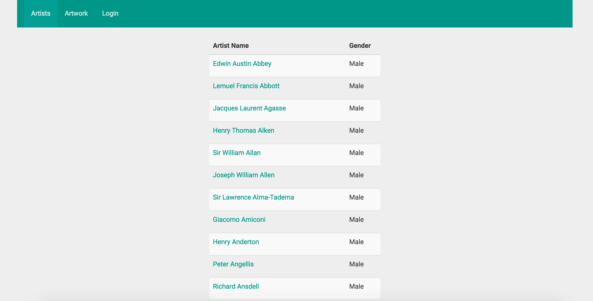
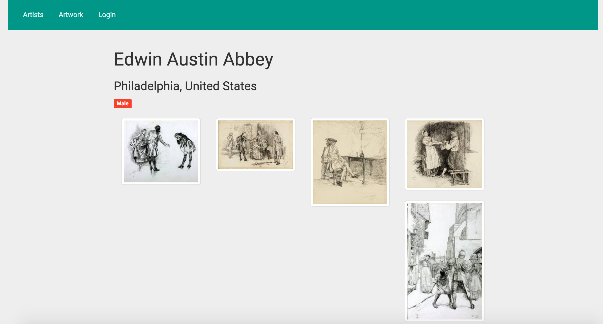
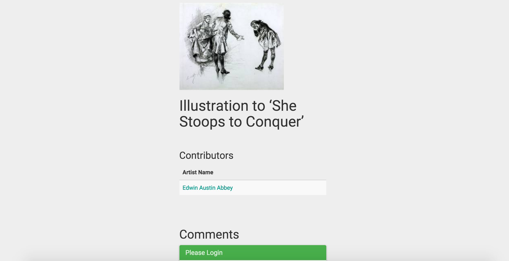
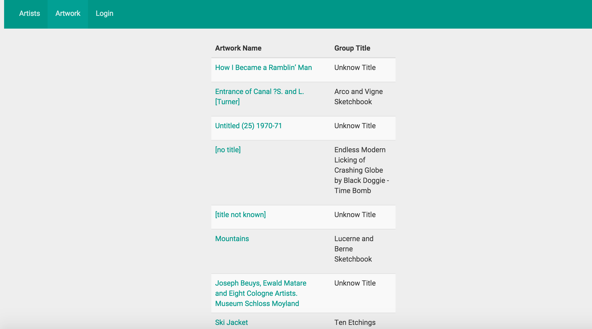
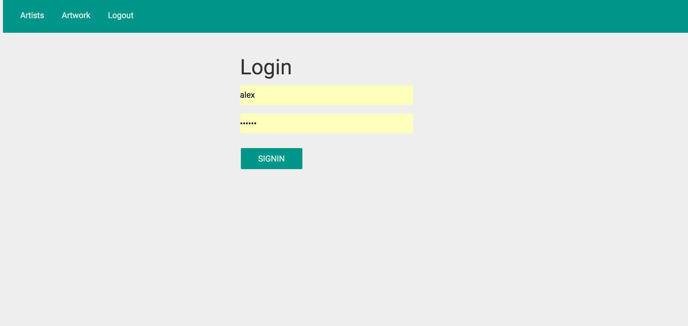
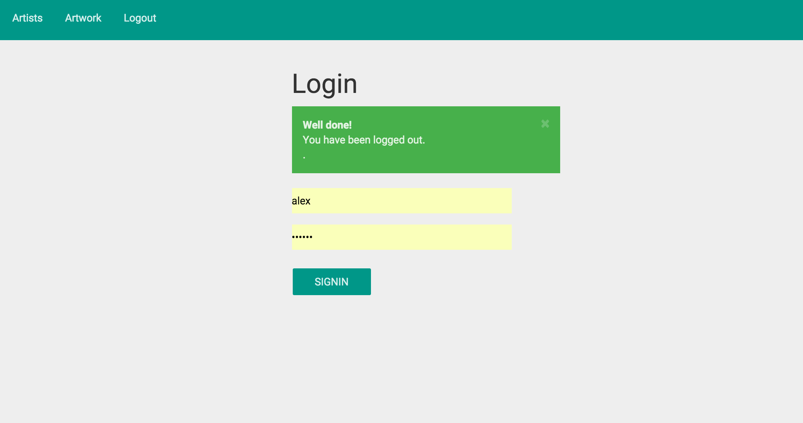
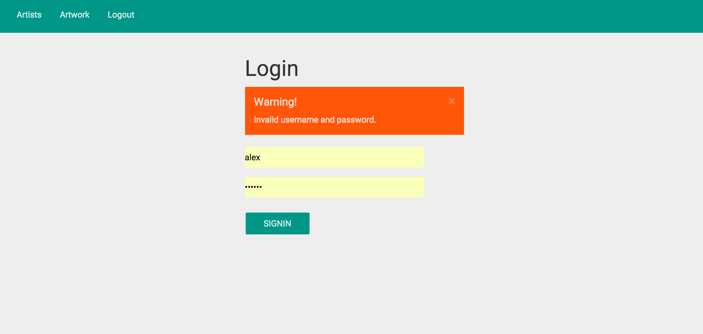

# Art Gallery : Spring Java example with Theamleaf

##Setup
1. Run the scheama in the resouce folder. This will fill the information from the json files (also located at the resouce folder)
2. Import the project , by file -> import ->  maven -> exisiting maven project.
3. Run the project , it will import the data
4. Visit : [The following](http://localhost:8888)

##Screenshots

## Help
###Login Details
Username : admin
Password : admin